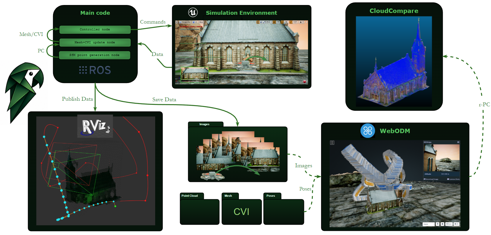

<p align="center">
  
</p>

# PAROT

**PAROT: Prior-Free Active Reconstruction with Online Mesh Visibility Trajectory Planning**

PAROT is a ROS/AirSim research system for active UAV image acquisition around an object of interest. It flies a simulated drone with a front-facing RGB camera, logs images and poses, updates a lightweight triangle-mesh proxy online, and plans new viewpoints until the object surface is sufficiently covered for 3D reconstruction.

The method assumes only a coarse 3D region-of-interest bounding box. It does not require an initialization flight, a depth sensor, or a learned shape-prior model in the paper configuration.

## What It Does

At runtime, PAROT runs three main blocks in parallel:

1. **Controller and planner** (`src/controller/nodes/controller_v01.py`)
   - Captures RGB images and camera poses from AirSim.
   - Samples next-best-view candidates from active mesh regions.
   - Builds a CVI-aware cyclic route with LKH/greedy fallback logic.
   - Generates collision-aware local path segments and force-field camera orientations.
   - Commands the drone and records path, images, poses, and mission metrics.

2. **Sparse geometry node** (`src/rt_meshing/nodes/rt_geometry_points_node.py`)
   - Reads the logged image/pose stream.
   - Detects and matches RGB features across keyframes.
   - Triangulates sparse 3D points used as online geometric evidence.

3. **Mesh and CVI update node** (`src/rt_meshing/nodes/rt_mesh_cvi_update_node.py`)
   - Initializes a triangle mesh from the coarse RoI box.
   - Accumulates per-triangle Cumulative Visibility Index (CVI).
   - Associates sparse 3D points to nearby mesh vertices.
   - Refines supported vertices, shrinks unsupported visible regions, and updates triangle confidence.

The same triangle mesh is both the planning surface and the coverage memory. Triangles with low effective CVI remain active and continue to attract viewpoints; triangles that exceed the CVI threshold are removed from planning. The mission terminates when the active fraction falls below the configured threshold.

## Repository Layout

- `src/controller/` - AirSim controller, viewpoint sampling, routing, local path/orientation logic, RViz visualization, and run logging.
- `src/rt_meshing/` - sparse point generation, online mesh update, and CVI accumulation nodes.
- `src/quadrotor_msgs/` - message definitions used by the controller bridge.
- `testing/` - offline evaluation, pose conversion, WebODM/Metashape helpers, figure rendering, and RViz replay tools.
- `assets/` - README assets.

## Requirements

The code is organized as a ROS catkin workspace and was developed around:

- Ubuntu 20.04
- ROS Noetic
- Python 3
- `catkin_tools`
- AirSim/Unreal Engine 4 with `airsim_ros_pkgs`
- OpenCV, NumPy, SciPy, PyYAML
- LKH-3 for the paper route-planning configuration

The launch files assume an AirSim vehicle named `drone_1` and an AirSim ROS interface exposing odometry, RGB images, and local-position goal services.

## Installation

Clone or place this repository as a catkin workspace, then install ROS dependencies and build:

```bash
cd ~/Documents/PAROT
rosdep update
rosdep install --from-paths src --ignore-src -r -y
catkin build
source devel/setup.bash
```

If Python packages are missing, install them through the ROS/system Python environment:

```bash
sudo apt install python3-numpy python3-scipy python3-opencv python3-yaml
```

If you use `catkin_make` instead of `catkin_tools`, build with `catkin_make` and source the same `devel/setup.bash`.

Install and build LKH-3 separately, then set its path in:

```text
src/controller/config/controller.yaml
```

under `rt_meshing/mesh_view_plan_lkh_binary`.

## Configuration

Main runtime settings live in:

```text
src/controller/config/controller.yaml
```

For the PAROT paper pipeline, the important settings are:

- `building.active_profile`: selects the RoI box profile for the object.
- `file_paths.img_dir`, `file_paths.poses_dir`, `file_paths.mesh_path`: output locations for images, poses, mesh state, and intermediate files.
- `rt_meshing/pathing_mode: "atsp"`: use the CVI-aware planned trajectory.
- `rt_meshing/geometry_point_source: "sfm"`: use RGB sparse-SfM points as the mesh-update signal.
- `rt_meshing/mesh_view_sampling_mode: "regions"`: group active triangles into regions before sampling viewpoints.
- `rt_meshing/mesh_view_plan_backend: "lkh"`: use LKH-3 for the cyclic route.
- `rt_meshing/mesh_view_termination_cvi_threshold`: effective-CVI coverage threshold.
- `rt_meshing/mesh_view_termination_active_fraction_epsilon`: termination active-fraction threshold.

Before a run, choose the active scene profile and verify that all absolute paths in the YAML match your machine.

## Usage

Start the Unreal/AirSim environment and the AirSim ROS wrapper first. Then, in sourced terminals:

```bash
cd ~/Documents/PAROT
source devel/setup.bash
roslaunch controller airsim_with_pos_cmd_bridge.launch
```

Start the geometry and mesh/CVI nodes:

```bash
cd ~/Documents/PAROT
source devel/setup.bash
roslaunch rt_meshing rt_geometry_points.launch
```

```bash
cd ~/Documents/PAROT
source devel/setup.bash
roslaunch rt_meshing rt_mesh_cvi_update.launch
```

Optionally start RViz visualization:

```bash
cd ~/Documents/PAROT
source devel/setup.bash
roslaunch controller viewpoint_visualization.launch
```

Start the controller:

```bash
cd ~/Documents/PAROT
source devel/setup.bash
roslaunch controller controller.launch
```

The run stops when the configured CVI active-fraction termination condition is met. The controller saves RGB images, pose logs, mission metrics, the actual flight path, and an RViz replay bundle in the configured output folders.

## Outputs

Typical run outputs include:

- `images/image_*.jpg` - captured RGB images.
- `poses/poses.txt` and `poses/poses_degrees.txt` - camera poses.
- `poses/mission_metrics.txt` and `poses/mission_metrics.json` - mission time, path length, image count, and completion status.
- `poses/actual_path.txt` - sampled executed path.
- `images/geo.txt` and `poses/poses_metashape_ypr.csv` - WebODM/Metashape pose export when conversion is enabled.
- `rviz_replay/` - final mesh, geometry points, trajectory markers, and metadata for replay visualization.
- `RT_meshing/Mesh_Space/.../mesh_latest.npz` - latest mesh/CVI state.
- `RT_meshing/Mesh_Space/.../sparse_latest.npz` - latest sparse 3D points.

## Useful Utilities

- `testing/convert_poses_file.py` converts pose logs for Metashape and WebODM.
- `testing/visualize_metashape_poses.py` visualizes exported camera poses.
- `testing/visualize_iros_run_rviz.py` publishes saved run artifacts for RViz.
- `testing/render_model_with_path.py` renders point-cloud and trajectory figures for experiments.

## Citation
